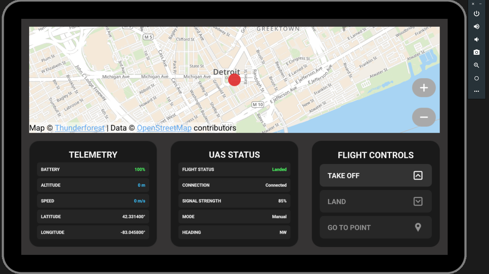

# Ground Control Station (GCS)

A simplified Ground Control Station (GCS) application prototype that allows users to monitor and control a simulated Uncrewed Aerial System (UAS).

## Overview

This application provides a user interface for monitoring and controlling a UAS (drone) with features commonly found in professional ground control stations. The application is designed with a Qt Quick/QML frontend for the user interface, with C++ backend classes that handle the business logic and simulation of the UAS.

## Architecture

The application follows a Model-View-Controller pattern:

- **Model**: TelemetryData represents the core data model, with TelemetryDataSimulator providing a simulated implementation
- **View**: QML files in the frontend directory provide the user interface
- **Controller**: UASStateMachine manages state transitions, while UAS class acts as the main controller component

Key design patterns used:
- **State Machine**: UASStateMachine implements a state pattern to manage UAS flight states
- **Strategy Pattern**: The TelemetryData interface allows for different implementations (simulation vs real hardware)
- **Singleton**: UAS and other key components are exposed as QML singletons for easy access

## Project Structure

The project is organized into the following structure:

```
/
├── CMakeLists.txt       # Main CMake build file
├── main.cpp             # Application entry point
├── resources.qrc        # Resource file for QML and images
├── images/              # Images for the application
├── src/
│   ├── backend/         # C++ backend code
│   │   ├── TelemetryData.hpp/cpp           # Base telemetry data interface
│   │   ├── TelemetryDataSimulator.hpp/cpp  # Simulated telemetry implementation
│   │   ├── UASStateMachine.hpp/cpp         # UAS state machine interface
│   │   ├── UASStateMachineSimulator.hpp/cpp # Simulated state machine implementation
│   │   ├── UAS.hpp/cpp                     # Main UAS controller class
│   │   └── MapController.hpp/cpp           # Map display controller
│   └── frontend/        # QML frontend code
│       ├── Main.qml                        # Application main window
│       ├── MapWidget.qml                   # Map display widget
│       ├── TelemetryWidget.qml             # Telemetry display widget
│       ├── ControlsWidget.qml              # Control buttons widget
│       ├── StatusWidget.qml                # UAS status widget
│       ├── ControlButton.qml               # Control button component
│       ├── MapButton.qml                   # Map control button component
│       ├── DataLabel.qml                   # Telemetry data label component
│       └── ConfirmationSlider.qml          # Slider with confirmation
└── tests/               # Unit tests directory
    ├── CMakeLists.txt                      # Test build configuration
    ├── TestTelemetryDataSimulator.cpp      # Tests for telemetry simulator
    └── TestUASStateMachine.cpp             # Tests for state machine
```

## Building the Project

You must have a Qt 6.8 install that includes that android libraries as well as the Location amd Positioning modules.

### Desktop

Configure the project with CMake:
```bash
mkdir build && cd build
cmake ..
```
Build the project:
```bash
make
```
Run the application (note this path is for macOS and it varies depending on host OS):
```
./appGroundControlStation.app/Contents/MacOS/appGroundControlStation
```
   
### Android

#### Prerequisites
Building for android requires a valid JDK and Android SDK/NDK.  Setting these up correctly is outlined here: https://doc.qt.io/qt-6/android-getting-started.html

### Android Prerequisites

1. Install the following tools:
   - Qt 6.8 or later with Android components
   - Android Studio (for Android SDK and NDK)
   - Java Development Kit (JDK) 11 or later
   - Android SDK Platform tools
   - Android NDK
   - Ninja

2. Configure Qt for Android:
   - In Qt Maintenance Tool, select and install Android components
   - Set up Android SDK, NDK, and JDK paths in Qt Creator preferences

### Build for Android

1. Configure Qt Creator for Android:
   - Open Qt Creator and load the project
   - In Projects tab, add Android Kit configuration (e.g., Android Qt 6.8.2 Clang arm64-v8a)
   - Set Android SDK and NDK paths if not auto-detected

2. Build using Qt Creator (recommended):
   - Select the Android kit configuration (e.g., Android Qt 6.8.2 Clang arm64-v8a)
   - Click Build → Build Project
   - Qt Creator will automatically run:
```bash
cmake --build <build-dir> --target all
androiddeployqt --input <settings.json> --output <android-build-dir> --android-platform android-34 --jdk <jdk-path> --gradle
```

3. Alternatively, build APK from command line:

   The steps below are most up-to-date here: https://doc.qt.io/qt-6/android-building-projects-from-commandline.html

```bash
# Set up environment variables
export ANDROID_SDK_ROOT=/path/to/Android/Sdk 
export ANDROID_NDK_ROOT=/path/to/Android/Sdk/ndk/[version]

# Create build directory
mkdir -p android-build

# Use qt-cmake wrapper for proper environment setup
~/Qt/[version]/[platform]/bin/qt-cmake \
   -DANDROID_SDK_ROOT=$ANDROID_SDK_ROOT \
   -DANDROID_NDK_ROOT=$ANDROID_NDK_ROOT \
   -DQT_ANDROID_ABIS="arm64-v8a" \
   -S . -B android-build \
   -GNinja

# Build the project and create APK
cmake --build android-build --target apk

# For multi-ABI builds (optional):
# ~/Qt/[version]/[platform]/bin/qt-cmake \
#    -DANDROID_SDK_ROOT=$ANDROID_SDK_ROOT \
#    -DANDROID_NDK_ROOT=$ANDROID_NDK_ROOT \
#    -DQT_ANDROID_ABIS="armeabi-v7a;arm64-v8a;x86;x86_64" \
#    -S . -B android-build-multi \
#    -GNinja
# cmake --build android-build-multi --target apk
```

### Deploy to Device

1. Enable Developer Options on your Android device:
   - Go to Settings → About Phone → Tap Build Number 7 times
   - Go to Settings → Developer Options → Enable USB Debugging

2. Connect your device via USB and deploy:
   - Connect device to computer with USB cable
   - From Qt Creator: Build → Deploy to Android
   - Allow USB debugging on device when prompted

3. Manual APK installation:
   - For Qt Creator builds: Locate the APK in `<build-dir>/android-build/build/outputs/apk/debug/` directory
   - For command-line builds: Locate the APK in `android-build/android-build/build/outputs/apk/debug/` directory
   - Install using ADB:
```bash
# List connected devices first to verify connection
adb devices

# Install the APK (replace with actual path)
adb install -r /path/to/android-build/build/outputs/apk/debug/android-build-debug.apk

# To uninstall the app if needed
adb uninstall org.qtproject.example.appGroundControlStation
```
The end result should look like this:


### Troubleshooting

- If the app crashes on startup, check device logs:
```bash  
adb logcat | grep org.qtproject.example.appGroundControlStation
  ```


## Features

- Map display with UAS location tracking and zoom controls
- Real-time telemetry data display (altitude, speed, battery)
- UAS state visualization (Landed, TakingOff, Flying, etc.)
- Takeoff and landing controls with confirmation
- Go-to waypoint navigation by clicking on the map
- Loitering functionality with configurable radius and direction
- Simulated flight physics with realistic transitions

## Testing

### Unit Tests

To run the unit tests:

1. Configure and build the tests:
```
cd tests
mkdir -p build && cd build
cmake ..
make
```
2. Run the tests:
```
./testGroundControlStation
```
   
3. Run with verbose output:
```
./testGroundControlStation -v
```
   
4. Run specific test functions:
```
./testGroundControlStation -functions testStateTransitions
```

The current tests cover:
- UASStateMachine tests:
  - State transitions
  - Signal emission during state changes
  - Proper enumeration values
  - State transition validation
- TelemetryDataSimulator tests:
  - Waypoint navigation (goTo functionality with loitering parameters)
  - State-based behavior changes
  - Signal emissions for telemetry changes
  - Invalid state transition validation

### GUI Tests with Squish

This project includes automated GUI tests using the Squish testing framework.

#### Prerequisites

- Squish for Qt installed (version 6.7 or higher)
- Squish license configured
- `squishrunner` and `squishserver` in your PATH

#### Running Squish Tests

1. Start the Squish server:
```
squishserver --daemon
```

2. Run all tests:
```
cd squish_tests
squishrunner --testsuite suite_GroundControlStation --testcase tc_all
```

3. Run a specific test case:
```
squishrunner --testsuite suite_GroundControlStation --testcase tc_TakeoffAndLand
```

4. Run tests with detailed output:
```
squishrunner --testsuite suite_GroundControlStation --testcase tc_all --reportgen html:TakeoffTestReport
```

5. View the test report:
```
open TakeoffTestReport/index.html
```

## Future Improvement Plans

### Architecture Improvements
- **Hardware Abstraction Layer**: Replace direct simulation with HAL to allow real hardware integration
- **Plugin System**: Create an architecture to support different vehicle types and communication protocols
- **Revamep Architecture**: Current architecture was designed with simulation in mind and has many limitations.

### Feature Enhancements
- **Mission Planning**: Add mission planning with multiple waypoints and mission items
- **Geofencing**: Implement geofencing with no-fly zones and containment areas
- **Multi-Vehicle Support**: Support controlling and monitoring multiple vehicles simultaneously
- **Logging System**: Implement flight data logging and replay functionality
- **3D Visualization**: Add 3D terrain and attitude visualization
- **Failsafe Behaviors**: Add configurable failsafe behaviors for low battery, lost link, etc.

### Technical Improvements
- **Test Coverage**: Expand unit tests to cover all components
- **CI/CD Pipeline**: Set up continuous integration and deployment
- **Documentation**: Generate API documentation with Doxygen
