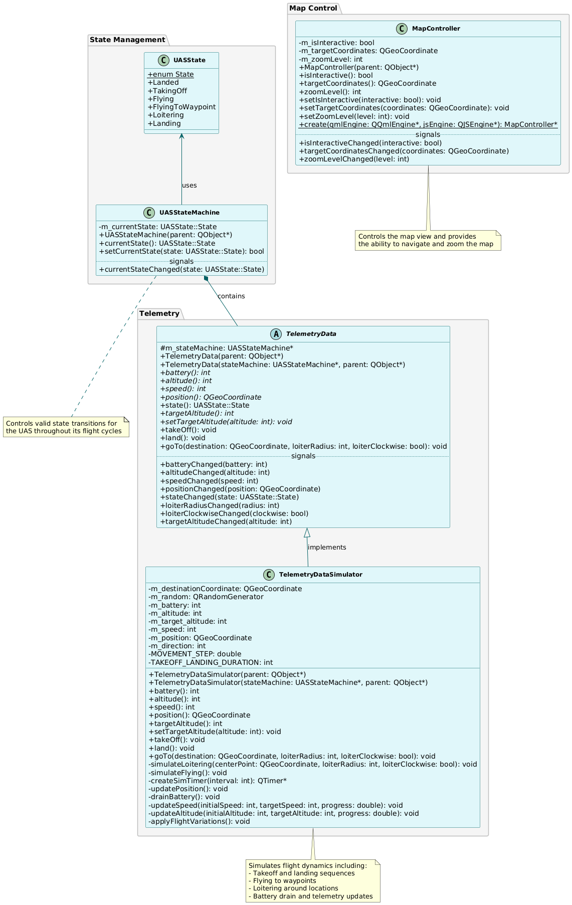
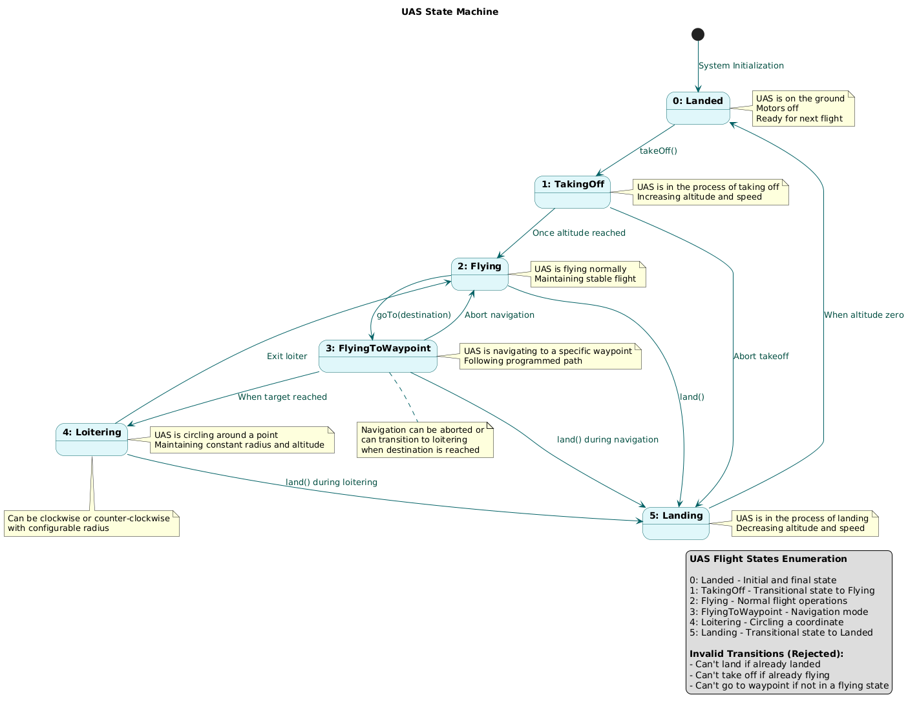
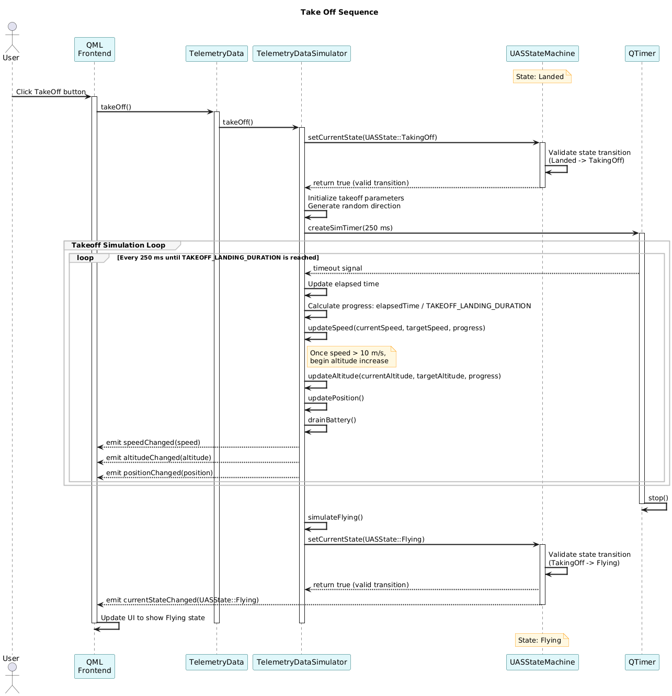
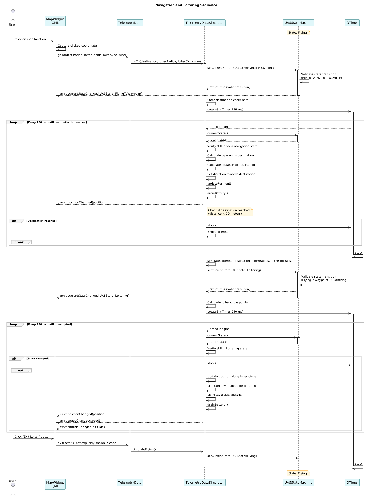
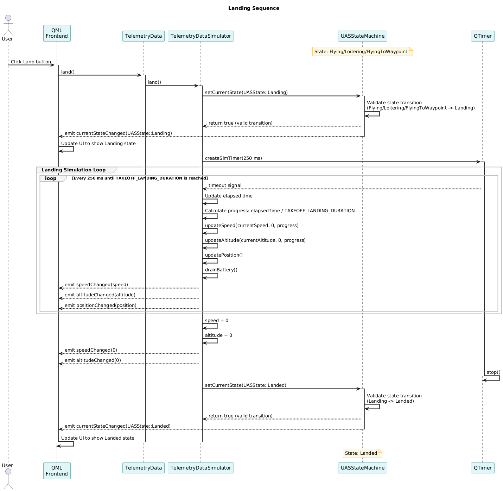

# Ground Control Station UML Designs

This directory contains UML diagrams that document the architecture and behavior of the Ground Control Station (GCS) application.

## Class Diagram

The class diagram shows the key components of the GCS system and their relationships.



## State Diagram

The state diagram illustrates the different states of the Uncrewed Aerial System (UAS) and the transitions between them.



## Sequence Diagrams

### Takeoff Sequence

This diagram shows the interactions between components during the takeoff operation.



### Navigation and Loitering Sequence

This diagram illustrates how the UAS navigates to a waypoint and then enters a loitering pattern.



### Landing Sequence

This diagram shows the interactions between components during the landing operation.



## Source Files

All diagrams are created using PlantUML. The source `.puml` files are included in this directory for future updates:

- `class_diagram.puml` - Class structure of the system
- `state_diagram.puml` - State machine for the UAS
- `takeoff_sequence.puml` - Sequence diagram for takeoff operation
- `navigation_loitering_sequence.puml` - Sequence diagram for navigation and loitering
- `landing_sequence.puml` - Sequence diagram for landing operation

## How to Update Diagrams

To update these diagrams:

1. Modify the corresponding `.puml` file
2. Generate PNG output using PlantUML
   ```
   java -jar plantuml.jar filename.puml
   ```
   
   Or use a PlantUML extension in your IDE (VS Code, IntelliJ, etc.)

3. Commit both the updated `.puml` file and the regenerated PNG